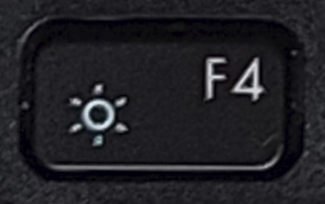
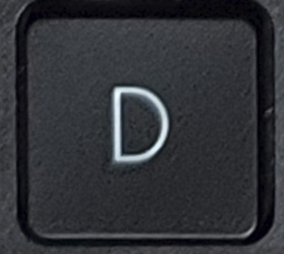
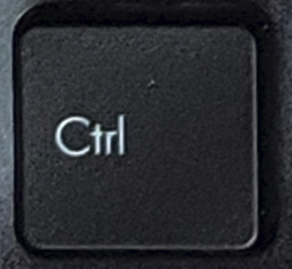
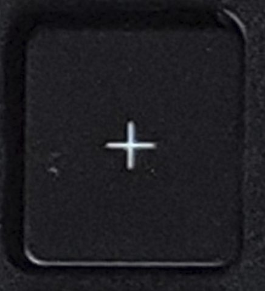
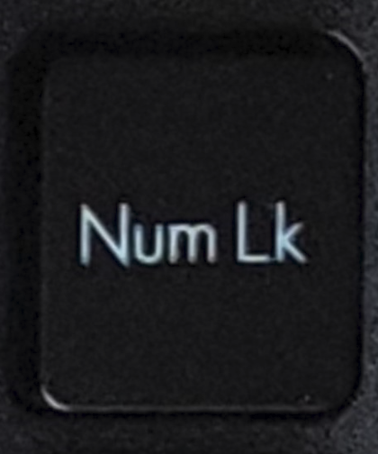

# KEYBOARD | ASUS VIVOBOOK S15 (K3502ZA)

|TECLAS|ACCIÓN|
|----|----|
|| Escape |
|| F1 → Ayuda   Fn + F1 → Silenciar|
|| F2 → Renombrar   Fn + F2 → Bajar Volumen|
|| F3 → Buscar   Fn + F3 → Subir Volumen|
|| F4 → Barra de Direcciones (Explorador)   Fn + F4 → Disminuir Brillo   Alt + F4 → Cerrar |
|| F5 → Actualizar   Fn + F5 → Aumentar Brillo|
|| F6 → Cambio de Menú   Fn + 6 → Panel Táctil|
|| F7 → *(vacío)*   Fn + F7 → Luz Teclado|
|| F8 → Modo Seguro    Fn + F8 → Proyectar|
|| F9 → *(vacío)*   Fn + F9 → Micrófono|
|| F10 → Menú principal   Fn + F10 → Cámara   Shift + F10 → Menú contextual|
|| F11 → Pantalla Completa (Navegador)   Fn + F11 → Captura Pantalla|
|| F12 → Inspeccionar (Navegador)   Fn + F12 → MyASUS|
|| Imprimir Pantalla|
|| Sobrescritura|
|| Eliminar selección|
|| º   ª *(Shift)*   \ *(Alt Gr)*|
|| 1   " *(Shift)*   `|` *(Alt Gr)*|
|| 2   " *(Shift)*   \| *(Alt Gr)*|
|| 3   · *(Shift)*   # *(Alt Gr)*|
|| 4   $ *(Shift)*   ~ *(Alt Gr)*|
|| 5   % *(Shift)*   € *(Alt Gr)*|
|| 6   & *(Shift)*   ¬ *(Alt Gr)*|
|| 7   / *(Shift)*|
|| 8   ( *(Shift)*|
|| 9   ) *(Shift)*|
|| 0   = *(Shift)*|
|| '   ? *(Shift)*|
|| ¡   ¿ *(Shift)*|
|| *Backspace*|
|| Tabulación|
|| Q q|
|| W w|
|| E e   € *(Alt Gr)*|
|| R r|
|| T t|
|| Y y|
|| U u|
|| I i|
|| O o|
|| P p|
|| `   ^ *(Shift)*   [ *(Alt Gr)*|
|| +   * *(Shift)*   ] *(Alt Gr)*|
|| ç   Ç *(Shift)*   } *(Alt Gr)*|
|| Bloquear Mayúsculas|
|| A a|
|| S s|
|| D d|
|| F f|
|| G g|
|| H h|
|| J j|
|| K k|
|| L l|
|| Ñ ñ|
|| ´   ¨ *(Shift)*   { *(Alt Gr)*|
|| *Enter*|
|| *Shift*|
|| <   > *(Shift)*|
|| Z z|
|| X x|
|| C c|
|| V v|
|| B b|
|| N n|
|| M m|
|| ,   ; *(Shift)*|
|| .   : *(Shift)*|
|| -   _ *(Shift)*|
|| *Shift*|
|| *Ctrl*|
|| *Activar Teclas de Acceso Rápido*   Fn + Esc → *Bloquear Activación*|
|| *Tecla Windows*|
|| *Alt*|
|| *Espacio*|
|| *Alt Gr*|
|| *Ctrl*   *+ Fn → Menú contextual* |
|| *Izquierda*   *+ Fn → Inicio*|
|| *Arriba*   *+ Fn → Retroceder Página*|
|| *Abajo*   *+ Fn → Avanzar Página*|
|| *Derecha*   *+ Fn → Fin*|
|| *|
|| /|
|| *Encendido*|
|| +|
|| -|
|| *Bloqueo Numérico*|
|| 7   *Inicio (Sin Num Lk)*|
|| 8   *Arriba (Sin Num Lk)*|
|| 9   *Retroceder Página (Sin Num Lk)*|
|| 4   *Izquierda (Sin Num Lk)*|
|| 5|
|| 6   *Derecha (Sin Num Lk)*||
|| 1   *Fin (Sin Num Lk)*|
|| 2   *Abajo (Sin Num Lk)*|
|| 3   *Avanzar Página (Sin Num Lk)*|
|| 0   *Insert (Sin Num Lk)*|
|| .   *Suprimir (Sin Num Lk)*|
|| *Enter*   *+ Fn → Abre Calculadora*|